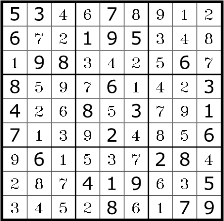

# OpenCV Sudoku Solver

A python script to solve sudoku puzzles using OpenCV. The script uses a CNN model to detect the cells from the sudoku puzzle and then uses ```Peter Norvig's``` sudoku solving algorithm [(Solving Every Sudoku Puzzle)](https://norvig.com/sudoku.html)

## How to use ?

- clone the repo <br>
```git clone git@github.com:tbrk1608/OpenCV-Sudoku-Solver.git```

- execute <br>
```cd src ```
```python opencv_sudokusolver.py --path test_examples\level_easy_0.png```

The solved puzzle is saved as an image in the src directory.

#### *Example input:*<br>


#### *Example output:*<br>



## To Do

- Improve the model to reorient the input images (perspective transformations) and detect numbers correctly
    - Currently only straight images are solved successsfully
    - Sometimes the model either cannot detect the numbers in the cell or predict it incorrect
- Solve puzzles from live camera feed or from video file (partially working !)
- Create a package

---
Credits : [Peter Norvig](https://norvig.com/), [PyImageSearch](https://pyimagesearch.com/)
